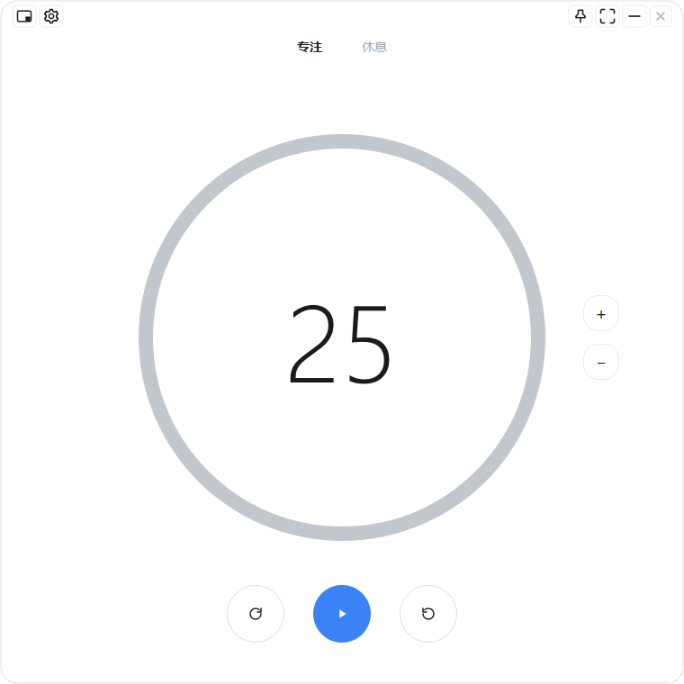

# Bingle时钟

一个极简的 Windows 桌面番茄钟（Pomodoro Timer），基于 PySide6 开发，界面简洁黑白风，专注/休息自由切换。

## 功能特性

- **专注 / 休息双模式页签**，可随时主动切换，不强制固定循环
- **休息不自动开始**：专注结束后进入休息界面，等你手动点开始（真正停下来休息）
- **时长自由调整**：点数字直接输入，`+` / `-` 每次 ±5 分钟，回车立即开始
- **专注完成弹窗 + 循环提示音**（≥10 秒），休息时长自动带入
- **缩小模式**：240×190 置顶小窗，自动定位屏幕右上角，双击展开
- **窗口控制**：置顶 / 全屏 / 最小化 / 无边框圆角，支持拖拽与缩放
- **设置**：专注/休息提示音（内置 5 种）、音量、开机自启
- **专注统计**：今日 / 本周 / 累计时长 + 近 7 天柱状图（只统计自然走完的专注，跳过/重置不计）

## 界面



## 技术栈

- Python 3.14 + PySide6
- 打包：PyInstaller（onedir 模式，约 88MB）
- 配置存储：`%APPDATA%\PomodoroTimer\config.json`（含统计）

## 目录结构

```
pomodoro_app/
├── main.py                 # 程序入口
├── Bingle时钟.spec          # PyInstaller 打包配置
└── pomodoro/
    ├── main_window.py      # 主界面
    ├── mini_window.py      # 缩小模式小窗
    ├── popup.py            # 时间到弹窗
    ├── settings_dialog.py  # 设置面板
    ├── stats_dialog.py     # 专注统计窗口
    ├── stats.py            # 统计数据存取
    ├── state.py            # 倒计时状态机
    ├── sounds.py           # 提示音管理
    ├── icons.py            # 图标绘制
    ├── config.py           # 配置读写
    └── widgets.py          # 进度环、无边框弹窗基类
```

## 运行 / 构建

```bash
# 运行
python main.py

# 打包（在 pomodoro_app 目录下）
python -m PyInstaller --noconfirm Bingle时钟.spec
```

## 文档

- [使用说明](Bingle时钟使用说明.md)
- [设计说明](Bingle时钟设计说明.md)
- [项目复盘](Bingle时钟项目复盘.md)
